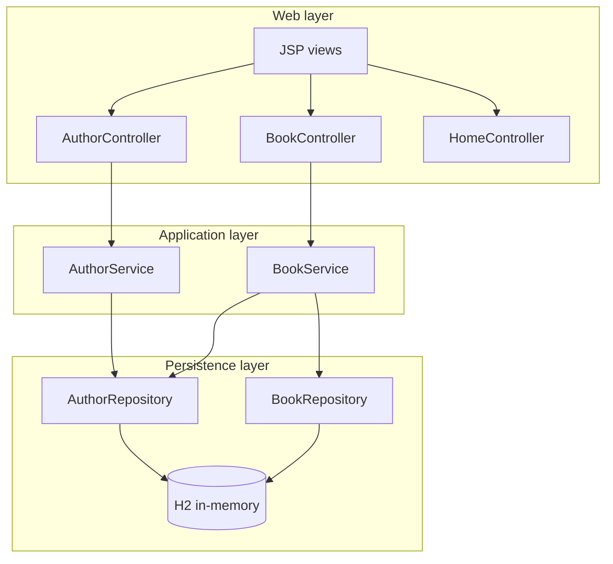
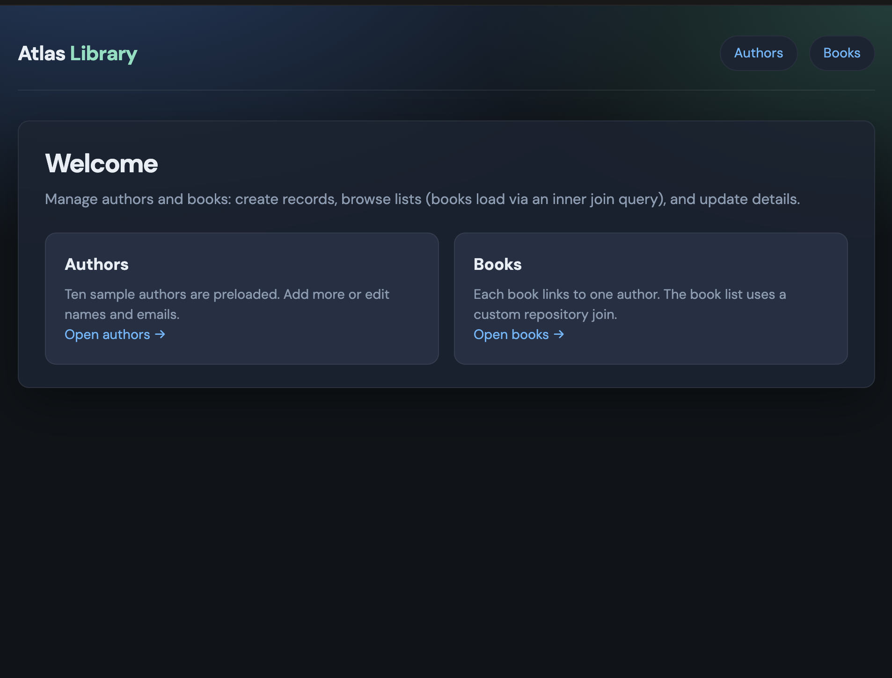
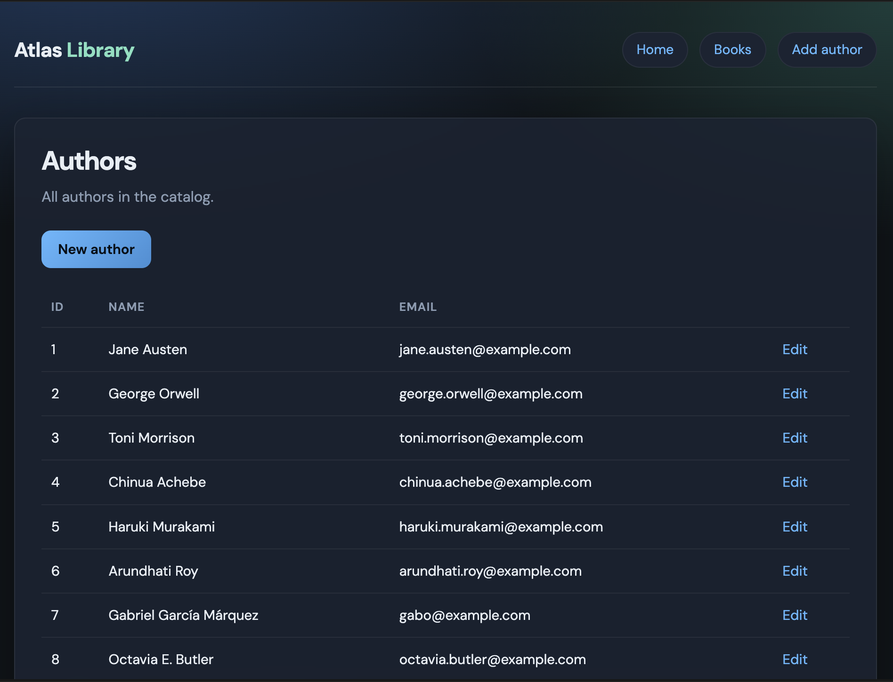
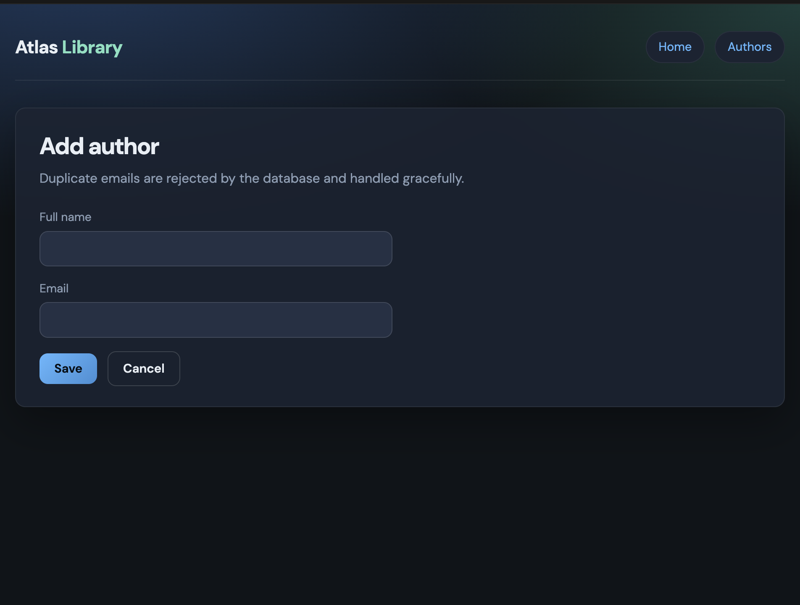
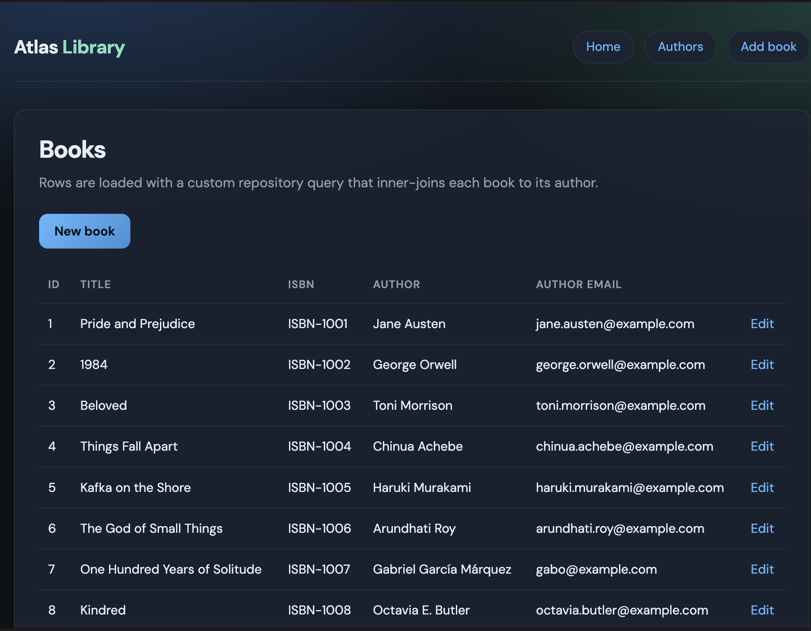
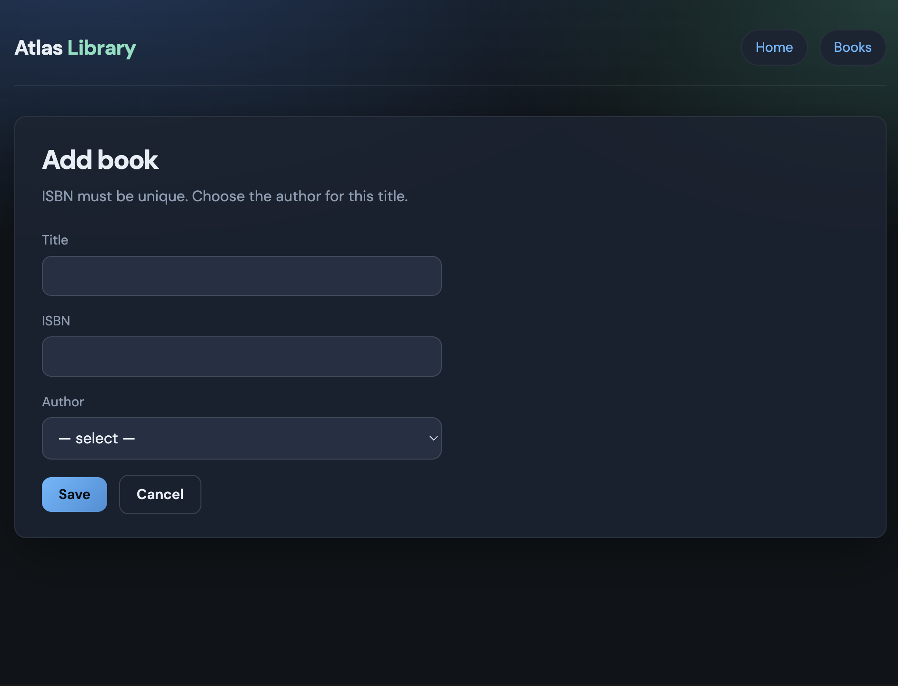
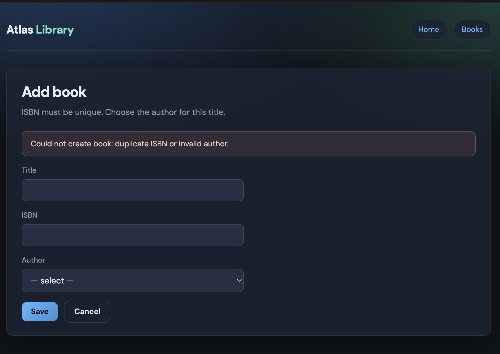

# Atlas Library — Spring Boot CRUD (Authors & Books)

A **Spring Boot** web application that manages **Authors** and **Books** with JPA relationships, layered architecture, **JSP** views, and **Create / Read / Update** operations. It was built to satisfy a course project brief: two related entities, repository custom queries (including an **inner join**), service and controller layers, user-facing forms and lists, exception handling for **data integrity** violations, and **unit tests** for repositories and services.

---

## Table of contents

1. [Project overview](#project-overview)
2. [Tech stack](#tech-stack)
3. [Architecture](#architecture)
4. [Domain design & entity relationships](#domain-design--entity-relationships)
5. [Features & assignment requirements](#features--assignment-requirements)
6. [Project structure](#project-structure)
7. [Installation & prerequisites](#installation--prerequisites)
8. [How to run](#how-to-run)
9. [Configuration](#configuration)
10. [Manual testing (web UI)](#manual-testing-web-ui)
11. [Automated tests](#automated-tests)
12. [Screenshots](#screenshots)
13. [Rubric & grading criteria mapping](#rubric--grading-criteria-mapping)
14. [Documentation & submission (PDF + GitHub)](#documentation--submission-pdf--github)
15. [Challenges & design notes](#challenges--design-notes)
16. [License](#license)

---

## Project overview

| Item | Description |
|------|-------------|
| **Purpose** | Manage catalog **authors** and their **books** through a browser UI. |
| **Entities** | `Author` (one-to-many books), `Book` (many-to-one author). |
| **Operations** | **Create** and **Update** via JSP forms; **Read** via list pages (books list uses a **custom inner-join** repository query). |
| **Data** | On first startup, **10 authors** and **10 books** are inserted (see `SampleDataLoader`). |
| **Database** | **H2** in-memory (development); schema generated by Hibernate (`ddl-auto=create-drop`). |

**Base package:** `com.example.library`  
**Main class:** `com.example.library.LibraryApplication`

---

## Tech stack

| Layer / concern | Technology |
|-----------------|------------|
| Runtime | **Java 17** (as declared in `pom.xml`; newer JDKs may work for local runs) |
| Framework | **Spring Boot 3.2.5** |
| Web / MVC | **Spring Web**, **Spring MVC** |
| Persistence | **Spring Data JPA**, **Hibernate** |
| Database | **H2** (embedded, in-memory) |
| Views | **JSP** (`tomcat-embed-jasper`), **JSTL** (`jakarta.servlet.jsp.jstl`), **Spring form tags** |
| Validation | **Jakarta Bean Validation** (`spring-boot-starter-validation`) |
| Build | **Maven** |
| Tests | **JUnit 5**, **Spring Boot Test**, **AssertJ**, **Mockito** |

---

## Architecture

The app follows a **classic layered architecture** with clear separation of concerns:

```
Browser (JSP + CSS)
        ↓ HTTP
Controller  →  Service  →  Repository  →  JPA / H2
        ↓              ↓
     Model /       @Transactional
     flash attrs     business rules
```

### Request flow (summary)

1. **Controller** maps URLs, binds request data to entities or request parameters, calls **service** methods, chooses a **view name** or **redirect**.
2. **Service** implements use cases (load author by id, save book with author, list books via join query) and runs inside **transactions** where needed.
3. **Repository** extends `JpaRepository` and declares **derived** and **custom `@Query`** methods.
4. **JSP** renders HTML using **EL**, **JSTL**, and **`form:`** tags; styles come from `src/main/resources/static/css/app.css`.

### Components at a glance

| Component | Responsibility |
|-----------|----------------|
| `*Controller` | HTTP handling, validation triggers, redirects, flash messages |
| `*Service` | Orchestration, `IllegalArgumentException` for missing ids |
| `*Repository` | CRUD + custom JPQL (inner join for books + authors) |
| `GlobalExceptionHandler` | `DataIntegrityViolationException`, `IllegalArgumentException`, static 404 resources |
| `SampleDataLoader` | Seeds **10 + 10** rows when tables are empty |

### Diagram (high level)



---

## Domain design & entity relationships

### ER-style description

- **Author** — attributes: `id`, `fullName`, `email` (**unique**).
- **Book** — attributes: `id`, `title`, `isbn` (**unique**), **foreign key** `author_id` → `authors.id`.

### JPA mapping

- **Author** → **Book**: **One-to-Many** (`Author.books`, `mappedBy = "author"`, cascade + orphan removal for the collection side).
- **Book** → **Author**: **Many-to-One** (`Book.author`, `optional = false`, LAZY fetch).

Integrity rules enforced in the database (via JPA column definitions) include **unique email** and **unique ISBN**, which can trigger **`DataIntegrityViolationException`** on duplicate create/update.

### Custom inner join (assignment requirement)

`BookRepository.findAllBooksWithAuthorsInnerJoin()` runs JPQL equivalent to joining **books** with **authors** so each `Book` in the result has its `Author` initialized for the list view:

```java
@Query("SELECT DISTINCT b FROM Book b INNER JOIN FETCH b.author a ORDER BY b.id ASC")
List<Book> findAllBooksWithAuthorsInnerJoin();
```

The **Books** list page calls this through `BookService.findAllWithAuthorsViaJoin()`.

---

## Features & assignment requirements

| Requirement | Implementation |
|-------------|----------------|
| Two entities + relationship | `Author`, `Book`; `@OneToMany` / `@ManyToOne` |
| Tables via JPA | Hibernate `ddl-auto`; H2 schema |
| **10 rows per table** (sample data) | `SampleDataLoader` |
| **Create** | JSP forms + `POST` handlers; validation |
| **Read** (lists) | JSP tables; books use **inner join** query |
| **Update** | Edit links, forms, `POST` to update routes |
| Custom **inner join** query | `BookRepository.findAllBooksWithAuthorsInnerJoin` |
| Repository layer | `JpaRepository` + custom `@Query` + `findByEmailIgnoreCase` |
| Service layer | `AuthorService`, `BookService` |
| Controller layer | `AuthorController`, `BookController`, `HomeController` |
| JSP + EL/JSTL | List and form pages under `WEB-INF/jsp` |
| CSS / UX | `static/css/app.css`, responsive-friendly layout |
| Integrity exceptions | Controller try/catch + `GlobalExceptionHandler` |
| Unit tests (repo + service) | `@DataJpaTest`, Mockito service tests |
| Web testing | Manual checklist below (also capture for PDF) |

---

## Project structure

```
springboot-proj/
├── pom.xml
├── README.md
├── src/main/java/com/example/library/
│   ├── LibraryApplication.java
│   ├── config/SampleDataLoader.java
│   ├── entity/Author.java, Book.java
│   ├── repository/AuthorRepository.java, BookRepository.java
│   ├── service/AuthorService.java, BookService.java
│   └── web/*.java (controllers + GlobalExceptionHandler)
├── src/main/resources/
│   ├── application.properties
│   └── static/css/app.css
├── src/main/webapp/WEB-INF/jsp/
│   ├── index.jsp, _header.jsp
│   ├── authors/list.jsp, form.jsp
│   ├── books/list.jsp, form.jsp
│   └── error/data-integrity.jsp, not-found.jsp
├── src/test/java/com/example/library/
│   ├── LibraryApplicationTests.java
│   ├── repository/*.java
│   └── service/*.java
└── docs/screenshots/          
```

---

## Installation & prerequisites

1. **JDK 17+** (project targets Java 17).
2. **Maven 3.9+** (or use your IDE’s Maven integration).
3. Clone the repository

```bash
git clone https://github.com/khushi-infinity/Atlas-Library.git
cd springboot-proj
```

---

## How to run

### Start the application

```bash
mvn spring-boot:run
```

### Open in browser

| Page | URL |
|------|-----|
| Home | http://localhost:8080/ |
| Authors list | http://localhost:8080/authors |
| New author | http://localhost:8080/authors/new |
| Books list | http://localhost:8080/books |
| New book | http://localhost:8080/books/new |

### H2 console (optional)

- URL: http://localhost:8080/h2-console  
- **JDBC URL:** `jdbc:h2:mem:librarydb`  
- **User:** `sa`  
- **Password:** *(leave empty)*  

---

## Configuration

Key settings in `src/main/resources/application.properties`:

| Property | Role |
|----------|------|
| `spring.datasource.url` | In-memory H2 database name |
| `spring.jpa.hibernate.ddl-auto` | `create-drop` (recreate schema each run) |
| `spring.mvc.view.prefix` / `suffix` | `/WEB-INF/jsp/` + `.jsp` |

---

## Manual testing (web UI)

Use this checklist for your own QA :

1. **Home** — Landing page loads; navigation links work.
2. **Authors — Read** — `/authors` shows at least **10** seeded authors.
3. **Authors — Create** — Add a new author; confirm redirect and list entry.
4. **Authors — Update** — Edit an author; confirm changes persist.
5. **Authors — Integrity** — Submit a **duplicate email**; expect flash error or data-integrity handling.
6. **Books — Read** — `/books` shows **10** books with **author name and email** (proves join-loaded data).
7. **Books — Create** — Add a book with title, ISBN, author; confirm in list.
8. **Books — Update** — Change title, ISBN, or author; confirm.
9. **Books — Integrity** — Submit a **duplicate ISBN**; expect error handling.

---

## Automated tests

```bash
mvn test
```

| Test class | What it covers |
|------------|----------------|
| `LibraryApplicationTests` | Spring context loads |
| `AuthorRepositoryTest` | Repository query `findByEmailIgnoreCase` |
| `BookRepositoryTest` | Custom **inner join** method returns books with authors |
| `AuthorServiceTest` | Update, create, not-found behavior (Mockito) |
| `BookServiceTest` | Join delegation, create with author, missing book |

---

## Screenshots


```markdown






```


---


## Challenges & design notes

- **Duplicate email / ISBN** — Enforced in the DB; Spring throws **`DataIntegrityViolationException`**. Controllers catch it on create/update where appropriate; `GlobalExceptionHandler` provides a fallback **conflict** view.
- **Book form and `author`** — The HTML form sends **`authorId`**; the service loads `Author` from `AuthorRepository` and sets `book.setAuthor(...)` before save.
- **Inner join list** — `INNER JOIN FETCH` avoids N+1 queries when rendering author columns on the book list.
- **Tests** — `BookService` depends on **`AuthorRepository`** (not `AuthorService`) for author lookup when saving books, which keeps dependencies simple and tests easy to mock on modern JDKs.

---


## Quick reference — main URLs

| Method | Path | Action |
|--------|------|--------|
| GET | `/` | Home |
| GET | `/authors` | List authors |
| GET | `/authors/new` | New author form |
| POST | `/authors` | Create author |
| GET | `/authors/{id}/edit` | Edit author form |
| POST | `/authors/{id}` | Update author |
| GET | `/books` | List books (inner join) |
| GET | `/books/new` | New book form |
| POST | `/books` | Create book |
| GET | `/books/{id}/edit` | Edit book form |
| POST | `/books/{id}` | Update book |

---
